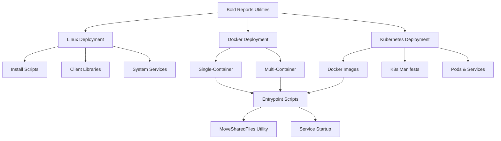
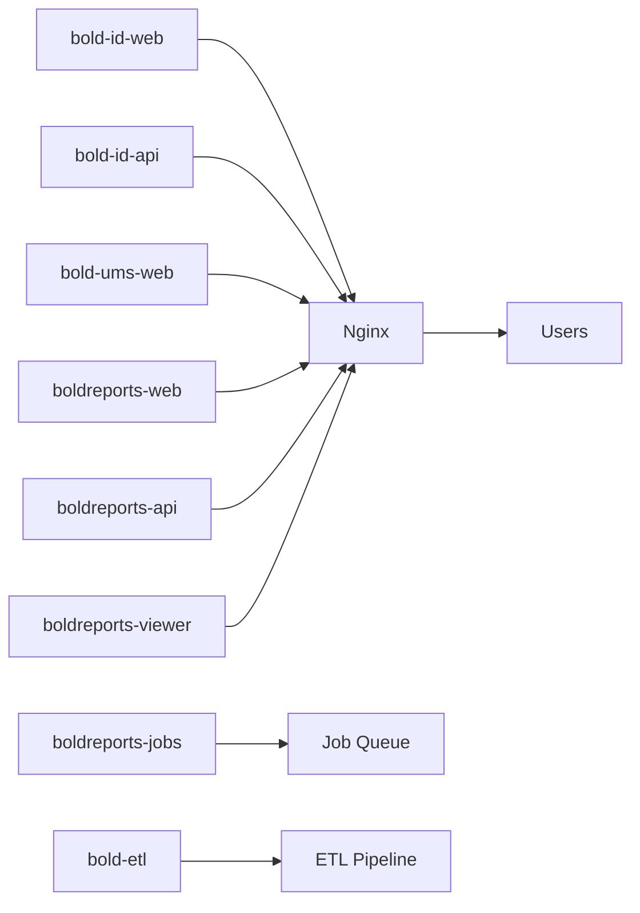
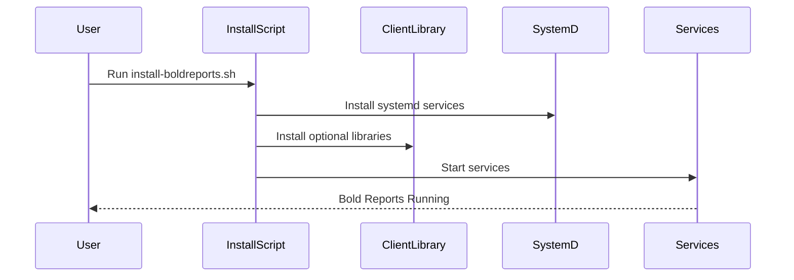
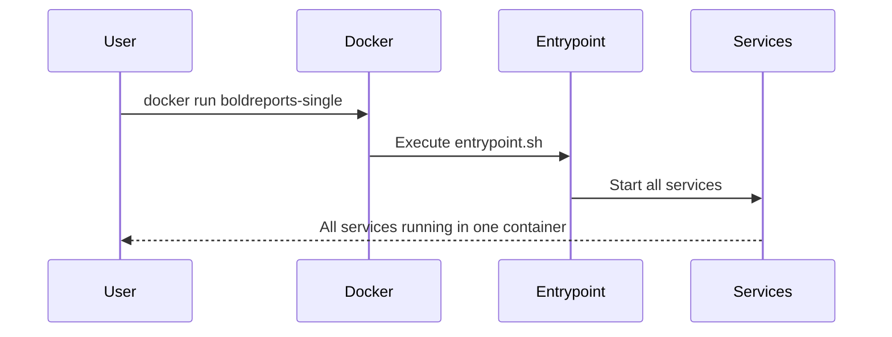
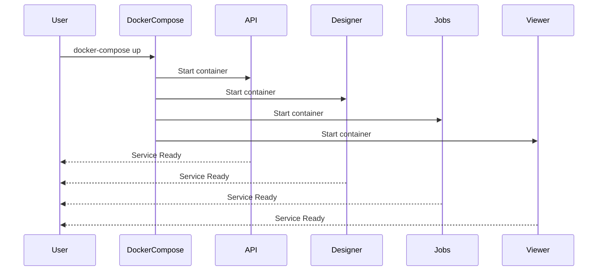
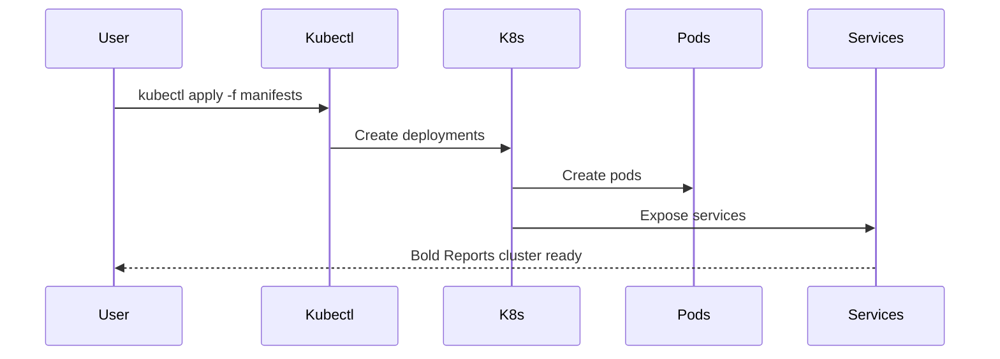

# Deployment Architecture

This document describes the deployment architecture of the Bold Reports Utilities system, including Linux, Docker, and Kubernetes deployment paths.

---

## System Overview

**Bold Reports Utilities** provides a flexible deployment system that supports three major deployment environments:

1. **Linux Native Deployment**
2. **Docker Single & Multi-Container Deployment**
3. **Kubernetes Cluster Deployment**

Each deployment path is designed to meet different infrastructure needs, from simple single-server setups to highly scalable cloud environments.

---

## Architecture Diagrams

### High-Level Deployment Architecture

### Service Architecture (Multi-Container)

### Linux Deployment Flow

### Docker Single-Container Flow

### Docker Multi-Container Flow

### Kubernetes Deployment Flow

---

## Component Descriptions

### 1. Linux Deployment Scripts

**Purpose**: Automate installation and uninstallation of Bold Reports on Linux systems.

**Key Files**:
- `build/linux/install-boldreports.sh`
- `build/linux/uninstall-boldreports.sh`
- `build/linux/boldreports-nginx-config`

**Features**:
- System service setup (systemd)
- Nginx configuration
- File permissions management
- Backup and rollback support

---

### 2. Client Library Management

**Purpose**: Install optional database client libraries for extended database support.

**Linux Installer**:
- `build/clientlibrary/Linux/install-optional.libs.sh`

**Windows Installer**:
- `build/clientlibrary/Azure/install-optional-libs.ps1`

**Supported Libraries**:
- MySQL (MySqlConnector.dll)
- PostgreSQL (Npgsql.dll)
- Oracle (Oracle.ManagedDataAccess.dll)
- Google BigQuery (BoldReports.Data.GoogleBigQuery.dll)
- Snowflake (Snowflake.Data.dll)

---

### 3. Docker Single-Container

**Purpose**: Package all Bold Reports services into a single Docker image for simplified deployment.

**Location**: `build/dockerfiles/latest/single-docker-image/`

**Components**:
- Dockerfiles for Ubuntu, Debian, Alpine (AMD64 & ARM64)
- Entrypoint script for service orchestration
- Product configuration (product.json)
- Client library utilities

**Use Cases**:
- Development environments
- Small-scale production deployments
- Quick testing and demos

---

### 4. Docker Multi-Container

**Purpose**: Deploy each Bold Reports service as a separate container for better scalability and management.

**Location**: `build/dockerfiles/latest/`

**Service Containers**:
- `bold-identity.txt` - Identity service
- `bold-idp-api.txt` - Identity API
- `bold-ums.txt` - User management service
- `boldreports-server.txt` - Main reporting web server
- `boldreports-server-api.txt` - Reporting API
- `boldreports-designer.txt` - Report designer service
- `boldreports-server-jobs.txt` - Background jobs service
- `boldreports-server-viewer.txt` - Report viewer service
- `bold-etl.txt` - ETL service

**Benefits**:
- Independent scaling of services
- Easier updates and rollbacks
- Better resource allocation
- Improved fault isolation

---

### 5. Kubernetes Deployment

**Purpose**: Orchestrate Bold Reports services at scale using Kubernetes.

**Image Building**: Uses Docker multi-container Dockerfiles from `build/dockerfiles/latest/`

**Kubernetes Resources**:
- Deployments for each service
- Services for internal networking
- ConfigMaps for configuration
- Persistent Volumes for data storage

**Features**:
- Auto-scaling
- Rolling updates
- Self-healing
- Load balancing

---

### 6. MoveSharedFiles Utility

**Purpose**: Automate file movement during deployment and service initialization.

**Implementation**: .NET 8.0 console application

**Location**: `movesharedfiles/MoveSharedFiles/`

**Usage**: Invoked by entrypoint scripts to:
- Copy configuration files
- Move optional libraries
- Setup application data directories
- Update product configuration

---

### 7. Entrypoint Scripts

**Purpose**: Initialize and start services in containers.

**Locations**:
- `build/dockerfiles/latest/single-docker-image/entrypoint.sh`
- `movesharedfiles/MoveSharedFiles/shell_scripts/{service}/entrypoint.sh`

**Responsibilities**:
- Environment variable configuration
- MoveSharedFiles utility invocation
- Database connection verification
- Service startup

---

## Deployment Patterns

### Pattern 1: Simple Linux Deployment

**Best For**: Small teams, single server

**Steps**:
1. Run `install-boldreports.sh`
2. Install optional client libraries
3. Configure Nginx
4. Start systemd services

---

### Pattern 2: Docker Single-Container

**Best For**: Development, testing, small deployments

**Steps**:
1. Build Docker image from `single-docker-image/`
2. Run container with environment variables
3. Map ports and volumes
4. Access via browser

---

### Pattern 3: Docker Multi-Container

**Best For**: Production, medium to large scale

**Steps**:
1. Build images for each service
2. Use Docker Compose or manual orchestration
3. Configure inter-service networking
4. Setup persistent storage

---

### Pattern 4: Kubernetes Cluster

**Best For**: Enterprise, cloud-native, high availability

**Steps**:
1. Build Docker images for services
2. Push images to registry
3. Apply Kubernetes manifests
4. Configure ingress and load balancing
5. Setup monitoring and logging

---

## Version Management

The system supports multiple versions through versioned folders:

- `build/dockerfiles/latest/` - Current development version
- `build/dockerfiles/12.1_dockerfiles/` - Version 12.1
- `build/dockerfiles/11.1_dockerfiles/` - Version 11.1
- ...and earlier versions

Each version maintains its own Dockerfiles and configurations for stability.

---

## Infrastructure Requirements

### Linux Deployment
- OS: Ubuntu 18.04+, Debian 10+, or compatible
- RAM: 4GB minimum, 8GB recommended
- Storage: 10GB minimum
- .NET 8.0 runtime
- Nginx web server

### Docker Single-Container
- Docker 20.10+
- RAM: 4GB minimum
- Storage: 15GB minimum
- CPU: 2 cores minimum

### Docker Multi-Container
- Docker 20.10+
- Docker Compose 2.0+
- RAM: 8GB minimum
- Storage: 20GB minimum
- CPU: 4 cores minimum

### Kubernetes
- Kubernetes 1.20+
- RAM: 16GB+ cluster capacity
- Storage: Persistent volume support
- LoadBalancer or Ingress controller

---

## Security Considerations

- SSL/TLS certificates for HTTPS
- Environment variable management for secrets
- Network policies for container isolation
- RBAC for Kubernetes deployments
- Regular security updates

---

## Monitoring & Logging

- Systemd journal for Linux deployments
- Docker logs for container deployments
- Kubernetes logs and metrics
- Application-level logging in `app_data` directories

---

*This architecture is designed for flexibility, allowing deployment in various environments from development to enterprise scale.*
