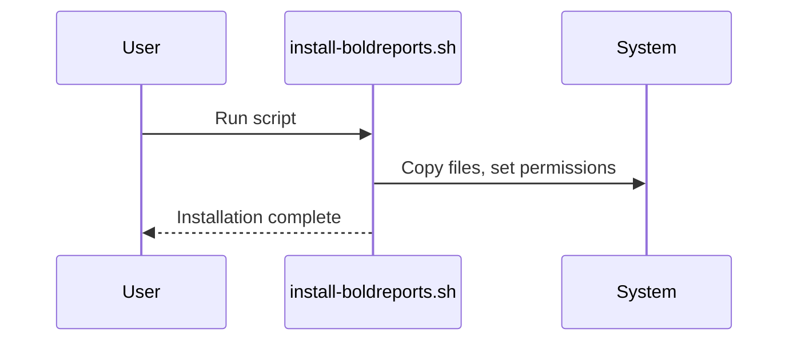
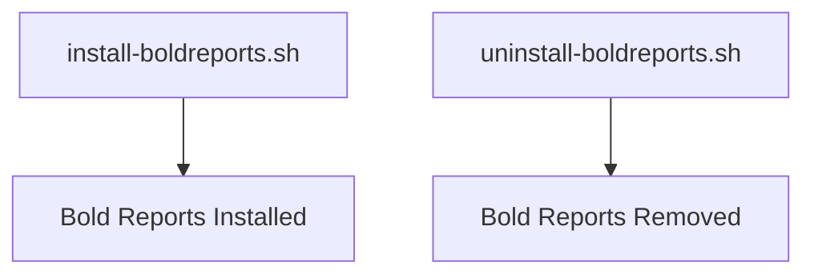

# Chapter 1: Linux Deployment Scripts

Welcome to the first chapter! Here, you'll learn how Bold Reports can be installed and uninstalled on Linux systems using simple shell scripts.

---

## Motivation

Imagine you want to set up Bold Reports on a fresh Linux server. Instead of manually copying files and configuring everything, you can use ready-made scripts to automate the process—saving time and reducing errors. These scripts are also handy for cleanly removing Bold Reports when needed.

---

## Key Concepts

- **Installation Script:** Automates the setup of Bold Reports on Linux.
- **Uninstallation Script:** Cleans up and removes Bold Reports from the system.
- **Infrastructure Directory:** Contains supporting files, like license agreements.

---

## How to Use It

### Install Bold Reports

```sh
sudo bash build/linux/install-boldreports.sh
```
This command runs the installation script. It will:
- Copy necessary files
- Set up permissions
- Configure services

**Explanation:**
Running this script prepares your Linux system for Bold Reports, handling all the setup steps for you.

### Uninstall Bold Reports

```sh
sudo bash build/linux/uninstall-boldreports.sh
```
This command removes Bold Reports and cleans up related files.

**Explanation:**
Use this script if you need to remove Bold Reports from your server, ensuring no leftover files remain.

---

## Internal Implementation

First, let's see how these scripts interact:



The scripts are located in:
- [build/linux/install-boldreports.sh](../../build/linux/install-boldreports.sh)
- [build/linux/uninstall-boldreports.sh](../../build/linux/uninstall-boldreports.sh)

They use standard shell commands to automate setup and cleanup.

---

## Cross References

- Next: [Client Library Installer (Linux)](02_client_library_installer_linux.md)
- See also: [Entrypoint Scripts](03_entrypoint_scripts.md)

---

## Diagrams



---

## Analogy & Example

Think of these scripts as a chef's recipe: follow the steps, and you get a delicious meal (a working Bold Reports system). If you want to clean up, just follow the cleanup recipe!

---

## Conclusion & Transition

You've learned how to quickly install and uninstall Bold Reports on Linux. Next, let's see how to add extra features with the [Client Library Installer (Linux)](02_client_library_installer_linux.md).
