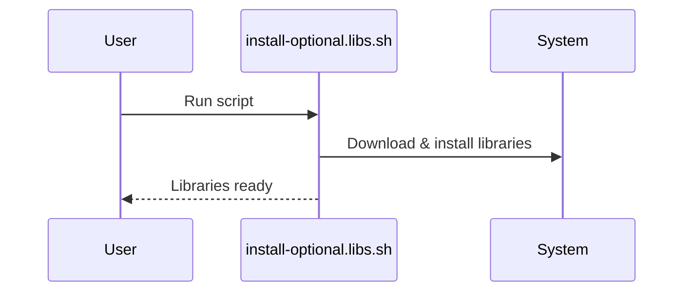
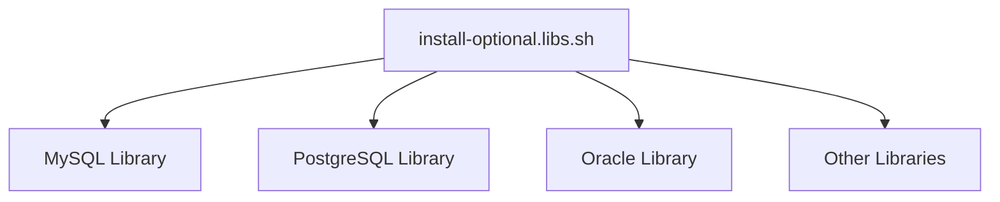

# Chapter 2: Client Library Installer (Linux)

[← Previous: Linux Deployment Scripts](01_linux_deployment_scripts.md)

---

## Motivation

Sometimes, your Bold Reports deployment needs to connect to extra databases or services. The Client Library Installer script lets you add these optional libraries easily, so your reports can access more data sources.

---

## Key Concepts

- **Optional Libraries:** Extra software packages for connecting to databases (like MySQL, PostgreSQL, Oracle, etc.).
- **Installer Script:** Automates the download and setup of these libraries.

---

## How to Use It

### Install Optional Libraries

```sh
sudo bash build/clientlibrary/Linux/install-optional.libs.sh
```
This command installs all supported optional libraries for Bold Reports on Linux.

**Explanation:**
Running this script ensures your Bold Reports instance can connect to a wide range of databases.

---

## Internal Implementation

Here's how the process works:



The script is located at:
- [build/clientlibrary/Linux/install-optional.libs.sh](../../build/clientlibrary/Linux/install-optional.libs.sh)

It uses shell commands to fetch and install the required libraries.

---

## Cross References

- Previous: [Linux Deployment Scripts](01_linux_deployment_scripts.md)
- Next: [Entrypoint Scripts](03_entrypoint_scripts.md)

---

## Diagrams



---

## Analogy & Example

Think of this script as a shopping list for your kitchen: you only buy (install) the ingredients (libraries) you need for your recipe (deployment)!

---

## Conclusion & Transition

Now you know how to extend Bold Reports with extra database support. Next, let's explore the [Entrypoint Scripts](03_entrypoint_scripts.md) that start up each service.
