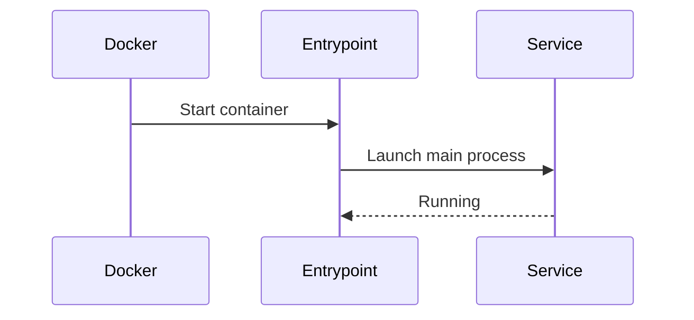
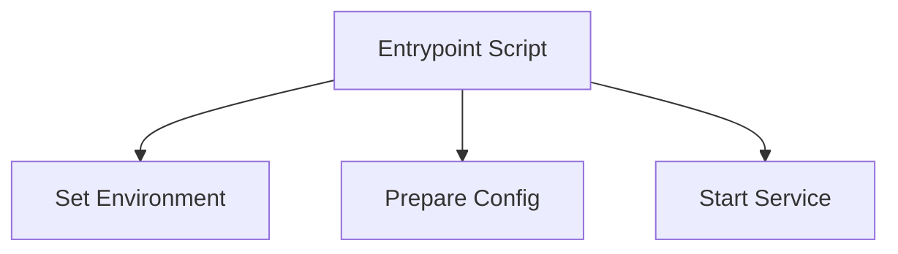

# Chapter 3: Entrypoint Scripts

[← Previous: Client Library Installer (Linux)](02_client_library_installer_linux.md)

---

## Motivation

Every service or container needs a way to start up correctly. Entrypoint scripts act as the main door, ensuring each service launches with the right settings and environment.

---

## Key Concepts

- **Entrypoint Script:** The first script run when a container or service starts.
- **Service Initialization:** Prepares the environment, sets variables, and launches the main process.

---

## How to Use It

### Example: Start a Service in a Container

```sh
docker run --entrypoint /entrypoint.sh my-boldreports-image
```
This tells Docker to use the entrypoint script when starting the container.

**Explanation:**
The entrypoint script sets up everything needed before the main application runs.

---

## Internal Implementation

Entrypoint scripts are found in:
- [movesharedfiles/MoveSharedFiles/shell_scripts/](../../movesharedfiles/MoveSharedFiles/shell_scripts/)
- [build/dockerfiles/latest/single-docker-image/entrypoint.sh](../../build/dockerfiles/latest/single-docker-image/entrypoint.sh)
- [build/linux/install-boldreports.sh](../../build/linux/install-boldreports.sh)

They typically:
- Set environment variables
- Prepare configuration files
- Start the main service



---

## Cross References

- Previous: [Client Library Installer (Linux)](02_client_library_installer_linux.md)
- Next: [Docker Single-Container Deployment](04_docker_single_container_deployment.md)

---

## Diagrams



---

## Analogy & Example

Think of the entrypoint script as the opening act of a play: it sets the stage so the main performance (service) can begin smoothly.

---

## Conclusion & Transition

Entrypoint scripts are essential for reliable service startup. Next, let's see how they fit into [Docker Single-Container Deployment](04_docker_single_container_deployment.md).
