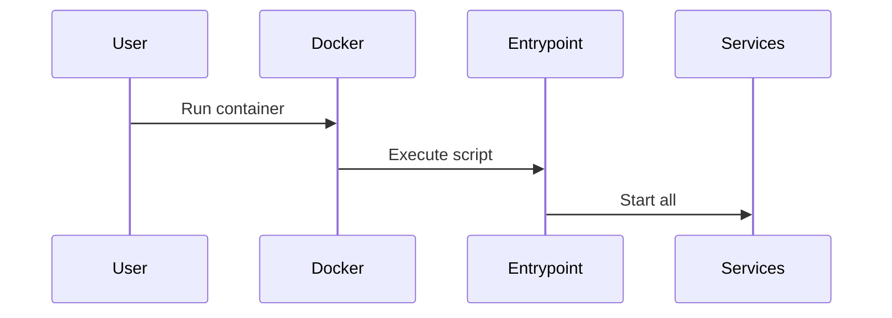
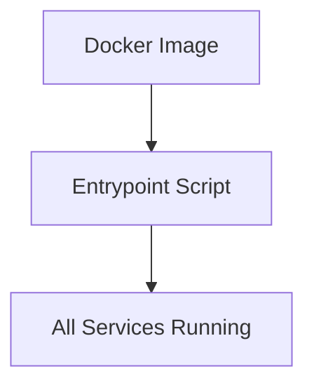

# Chapter 4: Docker Single-Container Deployment

[← Previous: Entrypoint Scripts](03_entrypoint_scripts.md)

---

## Motivation

Sometimes you want to deploy Bold Reports quickly, with everything in one place. Docker single-container deployment lets you package the whole application into a single image, making it easy to run, move, and manage.

---

## Key Concepts

- **Docker Image:** A snapshot of the application and its environment.
- **Single-Container:** All services bundled together in one container.
- **Entrypoint Script:** Starts everything inside the container.

---

## How to Use It

### Build the Docker Image

```sh
docker build -t boldreports-single build/dockerfiles/latest/single-docker-image/
```
This command creates a Docker image with everything needed for Bold Reports.

### Run the Container

```sh
docker run -d --name boldreports-single boldreports-single
```
This starts the container in the background.

**Explanation:**
You get a fully working Bold Reports instance with just two commands!

---

## Internal Implementation

Key files:
- [build/dockerfiles/latest/single-docker-image/entrypoint.sh](../../build/dockerfiles/latest/single-docker-image/entrypoint.sh)
- [build/dockerfiles/latest/single-docker-image/product.json](../../build/dockerfiles/latest/single-docker-image/product.json)

The entrypoint script ensures all services start up correctly inside the container.



---

## Cross References

- Previous: [Entrypoint Scripts](03_entrypoint_scripts.md)
- Next: [Docker Multi-Container Deployment](05_docker_multi_container_deployment.md)

---

## Diagrams



---

## Analogy & Example

Think of this as packing everything for a trip into one suitcase: open it anywhere, and you have all you need!

---

## Conclusion & Transition

You've learned how to deploy Bold Reports in a single container. Next, let's see how to scale up with [Docker Multi-Container Deployment](05_docker_multi_container_deployment.md).
