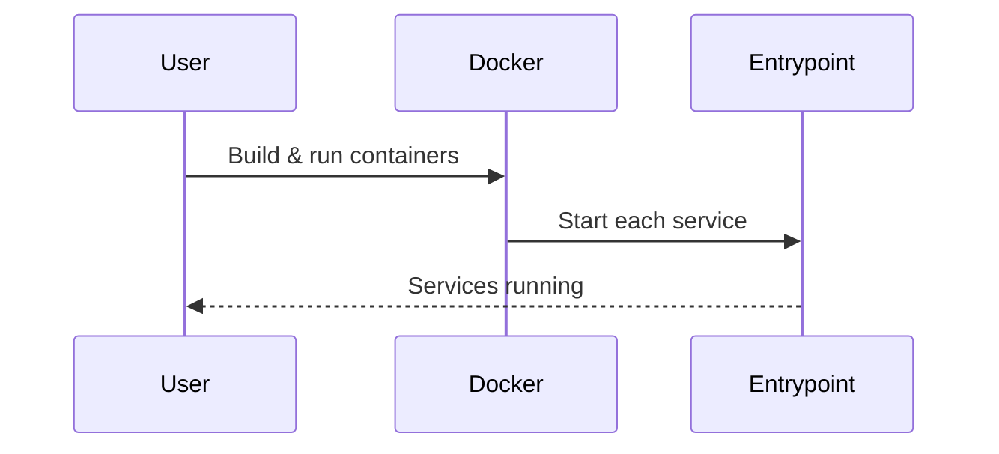
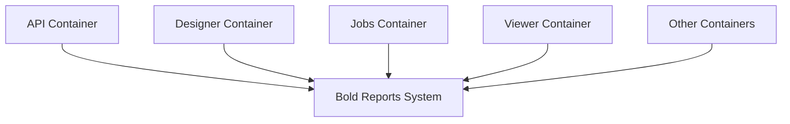

# Chapter 5: Docker Multi-Container Deployment

[← Previous: Docker Single-Container Deployment](04_docker_single_container_deployment.md)

---

## Motivation

For larger or more complex deployments, it's better to run each Bold Reports service in its own container. This approach makes it easier to scale, update, and manage each part independently.

---

## Key Concepts

- **Multi-Container:** Each service (API, Designer, Jobs, etc.) runs in its own Docker container.
- **Docker Compose / Manual:** You can use Docker Compose or run containers manually.
- **Service Dockerfiles:** Each service has its own Dockerfile and configuration.

---

## How to Use It

### Build Images for Each Service

```sh
docker build -t boldreports-api build/dockerfiles/latest/boldreports-server-api.txt
# Repeat for other services (designer, jobs, etc.)
```

### Run Each Container

```sh
docker run -d --name boldreports-api boldreports-api
# Repeat for other services
```

**Explanation:**
Each service runs in its own container, making the system modular and scalable.

---

## Internal Implementation

Key files:
- [build/dockerfiles/latest/](../../build/dockerfiles/latest/)
  - boldreports-server-api.txt
  - boldreports-designer.txt
  - boldreports-server-jobs.txt
  - ...and more

Each file defines how to build and run a specific service.



---

## Cross References

- Previous: [Docker Single-Container Deployment](04_docker_single_container_deployment.md)
- Next: [Kubernetes Deployment](06_kubernetes_deployment.md)

---

## Diagrams



---

## Analogy & Example

Think of this as a team where each member has a specific job. If one member needs a break (restart), the rest keep working!

---

## Conclusion & Transition

Now you know how to deploy Bold Reports with multiple containers. Next, let's see how this setup is used in [Kubernetes Deployment](06_kubernetes_deployment.md).
