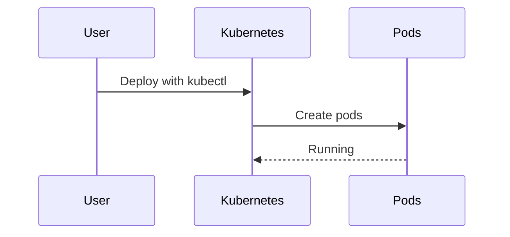
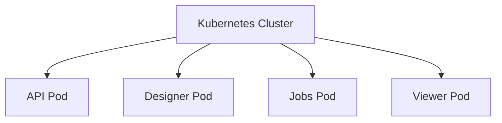

# Chapter 6: Kubernetes Deployment

[← Previous: Docker Multi-Container Deployment](05_docker_multi_container_deployment.md)

---

## Motivation

Kubernetes (K8s) automates container management at scale. By deploying Bold Reports on Kubernetes, you can handle updates, scaling, and failover automatically.

---

## Key Concepts

- **Kubernetes Cluster:** A group of servers running containerized applications.
- **Pods & Services:** Kubernetes objects that run and expose containers.
- **Dockerfiles for Image Building:** Uses the same Docker multi-container files to build images.

---

## How to Use It

### Build Images

```sh
docker build -t boldreports-api:latest -f build/dockerfiles/latest/boldreports-server-api.txt .
# Repeat for other services
```

### Deploy to Kubernetes

```sh
kubectl apply -f k8sfiles/your-deployment.yaml
```

**Explanation:**
This creates pods and services in your Kubernetes cluster, making Bold Reports available at scale.

---

## Internal Implementation

Key files:
- [build/dockerfiles/latest/](../../build/dockerfiles/latest/) — Dockerfiles for building images
- [k8sfiles/](../../k8sfiles/) — Kubernetes deployment configurations

Kubernetes uses these images and config files to manage the deployment.



---

## Cross References

- Previous: [Docker Multi-Container Deployment](05_docker_multi_container_deployment.md)
- Next: [MoveSharedFiles Utility](07_move_shared_files_utility.md)

---

## Diagrams



---

## Analogy & Example

Think of Kubernetes as an orchestra conductor: it ensures every musician (container) plays at the right time and volume!

---

## Conclusion & Transition

You've learned how Bold Reports runs on Kubernetes. Next, let's dive into the [MoveSharedFiles Utility](07_move_shared_files_utility.md) that supports deployment automation.
