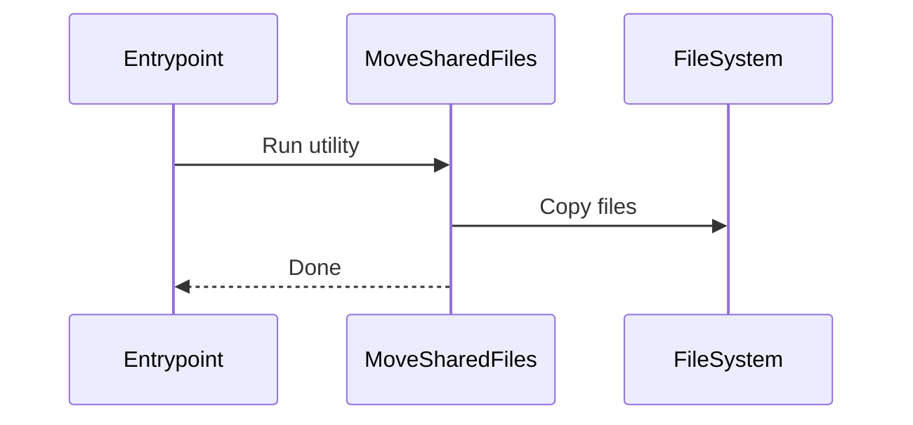
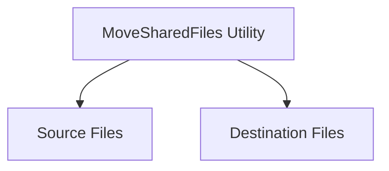

# Chapter 7: MoveSharedFiles Utility

[← Previous: Kubernetes Deployment](06_kubernetes_deployment.md)

---

## Motivation

During deployment, you often need to copy configuration files, binaries, or scripts to the right locations. The MoveSharedFiles utility automates this, saving time and reducing errors.

---

## Key Concepts

- **File Movement:** Copies files from source to destination.
- **.NET Utility:** A C# program that can be run on Windows or Linux (with .NET runtime).
- **Deployment Automation:** Ensures files are in the right place before services start.

---

## How to Use It

### Run the Utility

```sh
dotnet MoveSharedFiles.dll --source /path/to/source --dest /path/to/destination
```

**Explanation:**
This command copies files from the source directory to the destination directory.

---

## Internal Implementation

Key files:
- [movesharedfiles/MoveSharedFiles/Program.cs](../../movesharedfiles/MoveSharedFiles/Program.cs)
- [movesharedfiles/MoveSharedFiles/shell_scripts/](../../movesharedfiles/MoveSharedFiles/shell_scripts/)

The utility is used by entrypoint scripts to prepare the environment.



---

## Cross References

- Previous: [Kubernetes Deployment](06_kubernetes_deployment.md)
- Next: [Client Library Utility (Windows/.NET)](08_client_library_utility_windows.md)

---

## Diagrams



---

## Analogy & Example

Think of this utility as a moving company: it takes your boxes (files) from one house (directory) to another!

---

## Conclusion & Transition

You've learned how the MoveSharedFiles utility supports deployment. Next, let's explore the [Client Library Utility (Windows/.NET)](08_client_library_utility_windows.md).
