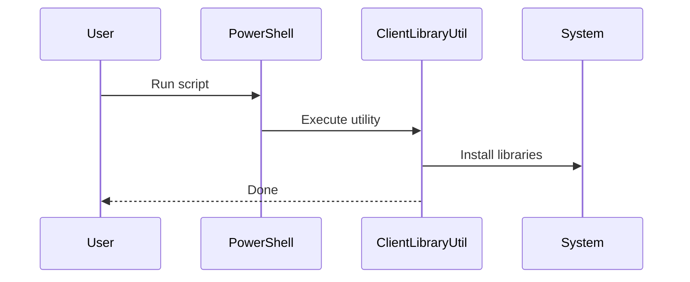
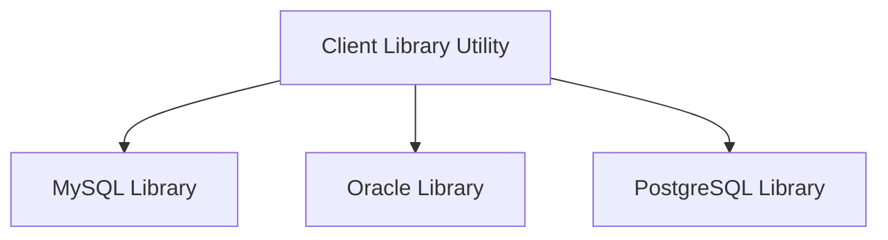

# Chapter 8: Client Library Utility (Windows/.NET)

[← Previous: MoveSharedFiles Utility](07_move_shared_files_utility.md)

---

## Motivation

Just like the Linux client library installer, Bold Reports on Windows sometimes needs extra database libraries. The Client Library Utility automates this process, making it easy to add optional libraries on Windows systems.

---

## Key Concepts

- **Client Library Utility:** A .NET application for managing optional libraries.
- **Windows & Azure:** Especially useful for Windows servers and Azure deployments.
- **PowerShell & C#:** Uses PowerShell scripts and C# code for installation.

---

## How to Use It

### Run the Utility (Windows)

```powershell
.\build\clientlibrary\Azure\install-optional-libs.ps1
```

**Explanation:**
This PowerShell script installs optional libraries on Windows systems.

---

## Internal Implementation

Key files:
- [build/clientlibrary/ClientLibraryUtil/Program.cs](../../build/clientlibrary/ClientLibraryUtil/Program.cs)
- [build/clientlibrary/Azure/install-optional-libs.ps1](../../build/clientlibrary/Azure/install-optional-libs.ps1)

The C# program and PowerShell script work together to download and install libraries.



---

## Cross References

- Previous: [MoveSharedFiles Utility](07_move_shared_files_utility.md)
- See also: [Client Library Installer (Linux)](02_client_library_installer_linux.md)

---

## Diagrams



---

## Analogy & Example

Think of this utility as a personal assistant: it fetches and installs the tools you need on Windows, saving you time!

---

## Conclusion

Congratulations! You've completed the tutorial on Bold Reports Utilities. You now understand how to deploy Bold Reports on Linux, Docker, and Kubernetes, and how to manage client libraries and file movement.

---

Generated by AI Codebase Knowledge Builder
