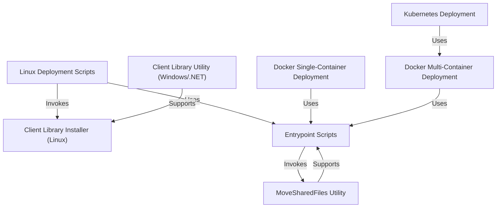

# Tutorial: Bold Reports Utilities Deployment System

**Bold Reports Utilities** is a comprehensive deployment toolkit for Bold Reports, supporting **Linux**, **Docker (single/multi-container)**, and **Kubernetes** environments. It provides scripts and utilities to automate installation, configuration, and management of services and client libraries, making deployment flexible and efficient for different infrastructures.

---

## Architecture Diagram

---

## Chapters

1. [Linux Deployment Scripts](01_linux_deployment_scripts.md)
2. [Client Library Installer (Linux)](02_client_library_installer_linux.md)
3. [Entrypoint Scripts](03_entrypoint_scripts.md)
4. [Docker Single-Container Deployment](04_docker_single_container_deployment.md)
5. [Docker Multi-Container Deployment](05_docker_multi_container_deployment.md)
6. [Kubernetes Deployment](06_kubernetes_deployment.md)
7. [MoveSharedFiles Utility](07_move_shared_files_utility.md)
8. [Client Library Utility (Windows/.NET)](08_client_library_utility_windows.md)

---

## About This Tutorial

This tutorial is designed for **beginners** who want to understand how the Bold Reports Utilities deployment system works. Each chapter:

- Explains the **motivation** behind the abstraction
- Covers the **key concepts** you need to know
- Shows **how to use** it with practical examples
- Dives into the **internal implementation** with diagrams
- Links to **related chapters** for deeper learning

Start with [Chapter 1: Linux Deployment Scripts](01_linux_deployment_scripts.md) and follow the chapters in order for the best learning experience.

---

## Key Deployment Paths

### Linux Deployment

- **Installation & Uninstallation script**: `build/linux/install-boldreports.sh` and `build/linux/uninstall-boldreports.sh`
- **ClientLibrary Installation script**: `build/clientlibrary/Linux/install-optional.libs.sh`

### Docker Deployment

- **Single Container deployment docker files**: `build/dockerfiles/latest/single-docker-image/` (version-specific files are also available; the `latest` folder is currently used for the upcoming version)
- **Multi Container deployment**: `build/dockerfiles/latest/` (all service docker files are available here; ignore `single-docker-image` for multi-container)

### Kubernetes Deployment

- **Image building**: Uses the same files as Docker multi-container folders
- **Folder path**: `build/dockerfiles/latest/`

---

## Additional Resources

- **Architecture Overview**: See [architecture/](../architecture/)
- **Tech Stack**: See [techstack/](../techstack/)

---

Generated by AI Codebase Knowledge Builder
